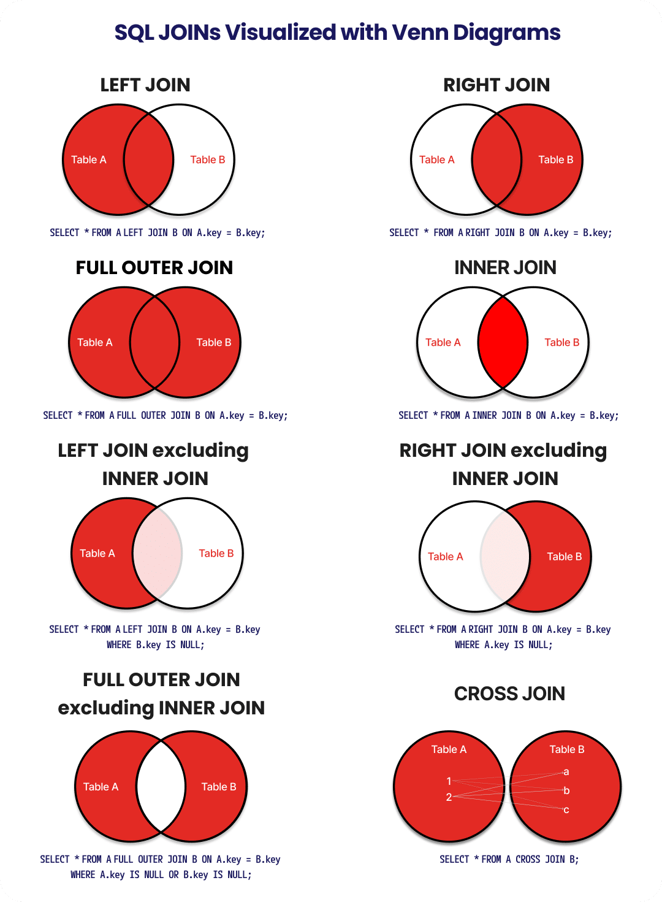

# Sql Commands

### Select
- Lets you choose which attributes you want the data from.

### Distinct
```
SELECT DISTINCT name
FROM customers;
```
- lets you choose unique values for the attribute

### Into
```
SELECT * INTO customers
FROM customers_backup;
```

- lets you copy data from one table into another

### Top
```
SELECT TOP 50 * FROM customers;

SELECT TOP 50 PERCENT * FROM customers;
```

- lets you select the top x number or percent of result.

### As

- renames a column / table with an alias we choose.

### FROM
- lets us choose which table we want to retrieve the data from.

### WHERE
- allows you to filter your query to only return results that match a set of conditions.

### AND

- combines 2 or more conditions in a single query, all of the conditions must be met for result to be returned

### OR

- combines 2 or more conditions in a single query, only 1 of the conditions must be met for result to be returned

### Between

```
SELECT name
FROM customers
WHERE age BETWEEN 45 AND 55;
```

- filters your query to return only results that fit a specified range.

- begin and end values are included.

### Like
- searches for a specified pattern in a column.
```
SELECT name
FROM customers
WHERE name LIKE ‘%Bob%’;
```

%x — will select all values that begin with x

%x% — will select all values that include x

x% — will select all values that end with x

x%y — will select all values that begin with x and end with y

_x% — will select all values have x as the second character

x_% — will select all values that begin with x and are at least two characters long. You can add additional _ characters to extend the length requirement, i.e. x___%

### In

```
SELECT name
FROM customers
WHERE name IN (‘Bob’, ‘Fred’, ‘Harry’);
```

- allows us to specify multiple values we want to select for when using the WHERE command.


### IS NULL

- checks if a data is null

### IS NOT NULL

- check if data is not null

### CREATE

- can be used to setup a database, table, index or view

### CREATE INDEX

- can be used for efficient searching.
```
CREATE INDEX idx_dept ON employees(department);
```
Index: idx_dept

"Finance" → [Row 2, Row 3]
"HR"      → [Row 1]
"IT"      → [Row 4]

so when you try to select a department, it knows which rows to go to stright away.


### CREATE VIEW

CREATE VIEW creates a virtual table based on the result set of an SQL statement. A view is like a regular table (and can be queried like one), but it is not saved as a permanent table in the database.


### DROP
DROP statements can be used to delete entire databases, tables or indexes.

### UPDATE
```
UPDATE customers
SET age = 56
WHERE name = ‘Bob’;
```
- updates data in the table.

### DELETE
- can delete all the rows or specific rows using WHERE


### ALTER TABLE
- allows you to create or delete columns in the table.
```
ALTER TABLE customers
ADD surname varchar(255);

ALTER TABLE customers
DROP COLUMN surname;
```


### GROUP BY
The GROUP BY statement groups rows with the same values into summary rows. The statement is often used with aggregate functions. For example, the code below will display the average age for each name that appears in our customers table.
```

SELECT name, AVG(age)
FROM customers
GROUP BY name;
```

### HAVING
HAVING performs the same action as the WHERE clause. The difference is that HAVING is used for aggregate functions, whereas WHERE doesn’t work with them.

```
SELECT COUNT(customer_id), name
FROM customers
GROUP BY name
HAVING COUNT(customer_id) > 2;
```

### ORDER BY
ORDER BY sets the order of the returned results. The order will be ascending by default.


### OFFSET
The OFFSET statement works with ORDER BY and specifies the number of rows to skip before starting to return rows from the query.

```
SELECT name
FROM customers
ORDER BY age
OFFSET 10 ROWS;
```

- it is usually used with LIMIT, both can be useful say when you want the 10th - 19th row.

### FETCH
FETCH specifies the number of rows to return after the OFFSET clause has been processed. The OFFSET clause is mandatory, while the FETCH clause is optional.

SELECT name
FROM customers
ORDER BY age
OFFSET 10 ROWS
FETCH NEXT 10 ROWS ONLY;

### Joins



### INNER JOIN
INNER JOIN selects records that have matching values in both tables. (intersection)

```
SELECT name
FROM customers
INNER JOIN orders
ON customers.customer_id = orders.customer_id;
```

### LEFT JOIN
LEFT JOIN selects records from the left table and records that match records in the right table.

### RIGHT JOIN
RIGHT JOIN selects records from the right table and records that match records in the left table.

### FULL JOIN
FULL JOIN selects records that have a match in the left or right table. Think of it as the “OR” JOIN compared with the “AND” JOIN (INNER JOIN).


### EXISTS
EXISTS is used to test for the existence of any record in a subquery.

```
SELECT name
FROM customers
WHERE EXISTS
(SELECT order FROM ORDERS WHERE customer_id = 1);
```

### TRUNCATE
TRUNCATE TABLE removes all data entries from a table in a database, but keeps the table and structure in place. Similar to DELETE.

### UNION
UNION combines multiple result-sets using two or more SELECT statements and eliminates duplicate rows.

### UNION ALL

keeps duplicate rows